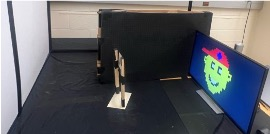

# TOWARDS 3D COMPUTATIONAL PERSICOPY WITH AN ORDINARY CAMERA: A SEPARABLE NON-LINEAR LEAST SQUARES FORMULATION.
## 3D NLOS imaging with an ordinary camera by exploiting unknown hidden 3D occluders

<table>
  <!-- Titles -->
  <tr>
    <td><b>Real Experimental SetUp</b></td>
    <td><b>Reconstructed 3D Occluder and 2D scene</b></td>
  </tr>
  <!-- Content -->
  <tr>
    <!-- Image -->
    <td>
      
    </td>
    <!-- GIF -->
    <td>
      
    </td>
  </tr>
</table>


## Citing SNLLS_3D-NLOS
If you use our codes or paper in your research, please cite this
```
@InProceedings{Fadlullah_2024_ICASSP,
author = {Fadlullah, Raji and John, Murray-Bruce},
}
```
## Getting Started

To run our results, follow these steps:

### Cloning the Repository

First, you need to clone the repository to your local machine. Open your terminal and run the following command:

```bash
git clone git@github.com:iscilab2020/SNLLS_3D-NLOS_OrdinaryCamera.git
```
Navigate to the cloned directory:

```bash
cd SNLLS_3D-NLOS_OrdinaryCamera
```

Create a Conda environment for the project:

```bash
conda create -n SNLLS python=3.8  # Replace with the required Python version
conda activate SNLLS
```
Install the software and the required dependencies:
```bash
pip install -e . 
```
Navigate into the Software:
```bash
cd SNLLS
```
Simulate and Reconstruct using the Lifting Method:
```bash
python3 test_lifting_method.py
```
Simulate and Reconstruct using the Alternating Minimization Method I:
```bash
python3 test_AMA_1.py
```
Simulate and Reconstruct using the Alternating Minimization Method II:
```bash
python3 test_AMA_2.py
```
Reconstruct Real World NLOS from captured 2D image using the Alternating Minimization Method II:
```bash
python3 test_real_world.py
```
You may combine the results to create Figure 4 in the paper :
```bash
python3 combined_results.py
```
Use Saunder's et al.'s reconstruction method to search location and reconstruct the scene using a known shape of the occluder
```bash
python3 grid_search.py
```
## NLOS Forward Model
We offer a comprehensive library designed to simulate the forward model for an arbitrary Non-Line-of-Sight (NLOS) setup. This library is an essential tool for researchers exploring NLOS configurations. It employs ray tracing techniques to simulate both the forward model and the shadowing effects caused by occluders. You can find the library in the following directory:
```bash
SNLLS/model/world_model
```
## Simulating the Forward Model

To simulate the forward model, use the following code snippet. This example demonstrates the setup on a CUDA-enabled device if available, falling back to CPU otherwise
```python
device = "cuda" if torch.cuda.is_available() else "cpu"

B = Forward_Model(camX_len=[0.808, 1.747], camZ_len=[0.05, 0.05+0.939], camDepth= 1.076, sceneDepth=0, scenePixels=(32, 32), 
                    camPixels=(128, 128), sceneX_len=[0, .708], sceneZ_len=[0.03, 0.436], occluders=None,
                    multiprocess=0, point_window=2, device=device, precision=32)
```
In this setup:

- The hidden scene plane is a 32x32 grid.
- The measurement plane is 128x128.
- `camDepth` specifies the depth from the hidden scene to the measurement plane.
- `camX_len` and `camZ_len` define the size of the camera's field of view.
- `sceneX_len` and `sceneZ_len` determine the dimensions of the hidden scene plane.

## Simulating the Pinspeck Forward Model

To replicate the Pinspeck forward model as described in our paper, use the following configuration
```python
device = "cuda" if torch.cuda.is_available() else "cpu"

B = Pinspeck(camX_len=[0.808, 1.747], camZ_len=[0.05, 0.05+0.939], camDepth= 1.076, sceneDepth=0, scenePixels=(32, 32), 
                    camPixels=(128, 128), sceneX_len=[0, .708], sceneZ_len=[0.03, 0.436], occluders=None,
                    multiprocess=0, point_window=2, device=device, precision=32, cube = True, num_points=[10, 3,10])
```
This configuration includes an additional parameter `cube` and `num_points`, enabling computation of the occluder space. `cube` either uses a voxel based voxelization of the occluder grid or a point based voxelization when set to False. and `num_points` is the size of the voxels along dimensions `x, y, and z`
 


