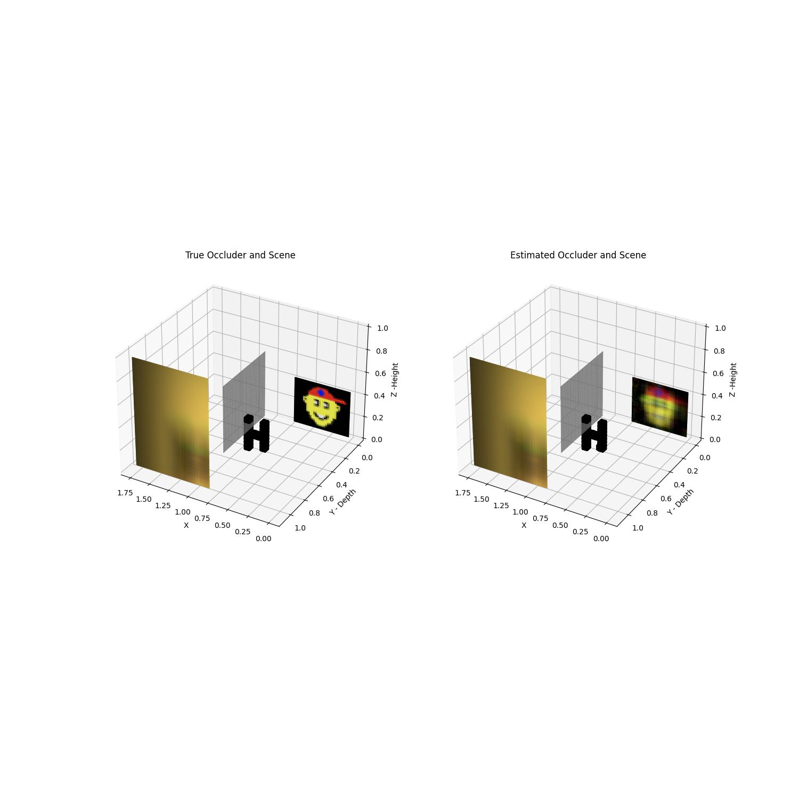

# TOWARDS 3D COMPUTATIONAL PERSICOPY WITH AN ORDINARY CAMERA: A SEPARABLE NON-LINEAR LEAST SQUARES FORMULATION.
## 3D NLOS imaging with an ordinary camera by exploiting unknown hidden 3D occluders

<table>
  <tr>
    <!-- GIF -->
    <td>
      
    </td>
    <!-- Image -->
    <td>
      
    </td>
  </tr>
</table>


## Citing SNLLS_3D-NLOS
If you use our codes or paper in your research, please cite this
```
@InProceedings{Fadlullah_2024_ICASSP,
author = {Fadlullah, Raji and John, Murray-Bruce},
}
```

To run our Results